# Delirium.cc - Zero-Knowledge Paste System

A secure, zero-knowledge paste system that ensures complete client-side encryption before data leaves the browser. Built with TypeScript, Kotlin (Ktor), and comprehensive testing. With features surrounding anonymity and privacy at its core. And if anyone asks you why you would appreciate privacy, just ask them why they have a lock on their door :)

I got this idea from the cool people over at PrivateBin and the old school paste bin usage back in the day. Feel free to suggest a feature, buy me a coffee, contribute to the repo, or just use one of your own. The source will always be open, so do what you wanna do. But reach out sometime if you'd like :)

HACK THE PLANET!

## 🚀 Quick Deploy to VPS

Deploy to a fresh VPS in under 5 minutes:

```bash
# SSH into your VPS
ssh root@your-vps-ip

# Run the one-command installer
curl -fsSL https://raw.githubusercontent.com/marcusb333/delerium-paste/main/scripts/vps-deploy.sh | bash -s your-domain.com your@email.com
```

**That's it!** The script will:
- ✅ Install Docker and dependencies
- ✅ Clone and build the application
- ✅ Configure SSL with Let's Encrypt
- ✅ Start the service on ports 80/443
- ✅ Set up automatic certificate renewal

**Requirements:**
- Ubuntu 22.04+ or Debian 11+ VPS
- Domain name pointed to your VPS IP
- At least 1GB RAM, 1 CPU core, 10GB disk

**Without a domain?** Skip SSL and run on port 8080:
```bash
curl -fsSL https://raw.githubusercontent.com/marcusb333/delerium-paste/main/scripts/vps-deploy.sh | bash
```

📖 **Detailed deployment guide:** [docs/deployment/DEPLOYMENT.md](docs/deployment/DEPLOYMENT.md)

## 💻 Local Development Setup

Get started locally in 2 minutes:

```bash
# Clone the repository
git clone https://github.com/marcusb333/delerium-paste.git
cd delerium-paste

# One-command setup and start
make quick-start
```

**That's it!** The application will open at `http://localhost:8080`

**Requirements:**
- Docker and Docker Compose
- Node.js 18+ (for building the client)
- Make (optional, can use docker compose directly)

**Manual start:**
```bash
# Build client
cd client && npm install && npm run build && cd ..

# Start services
docker compose up -d

# View logs
docker compose logs -f
```

📖 **Development guide:** [docs/development/](docs/development/)

---

## 🚀 Features

- **Zero-Knowledge Architecture**: Server never sees unencrypted content
- **Client-Side Encryption**: AES-256-GCM encryption in the browser
- **Proof of Work**: Spam protection through computational challenges
- **Single-View Pastes**: Self-destructing pastes for sensitive data
- **TypeScript Frontend**: Type-safe client-side code
- **Comprehensive Testing**: Unit, integration, and E2E test suites
- **Docker Support**: Full containerization for easy deployment

## 🏗️ Architecture

This project follows the **[C4 model](https://c4model.com/)** for architecture documentation. Full diagrams available in [`docs/architecture/C4-DIAGRAMS.md`](docs/architecture/C4-DIAGRAMS.md).

### System Context (C4 Level 1)

High-level view of Delirium in context:

```mermaid
graph TB
    User[("👤 User<br/>(Person)<br/>Wants to share sensitive<br/>information securely")]
    
    Delirium["🔐 Delirium<br/>(Software System)<br/>Zero-knowledge paste system with<br/>client-side encryption"]
    
    Browser["🌐 Web Browser<br/>(External System)<br/>Provides Web Crypto API<br/>for encryption"]
    
    User -->|"Creates/views pastes<br/>[HTTPS]"| Delirium
    Delirium -->|"Uses for<br/>encryption"| Browser
    
    style Delirium fill:#1168bd,stroke:#0b4884,color:#ffffff
    style User fill:#08427b,stroke:#052e56,color:#ffffff
    style Browser fill:#999999,stroke:#6b6b6b,color:#ffffff
```



**Key Principles:**
- **Zero-knowledge**: Server never sees unencrypted content
- **Client-side encryption**: All encryption happens in browser using Web Crypto API
- **Privacy-first**: No accounts, no tracking, no analytics

### Container Diagram (C4 Level 2)

Technology choices and how containers communicate:

```mermaid
graph TB
    subgraph "User's Device"
        Browser["🌐 Web Browser<br/>(Container: Browser)<br/>Renders UI and handles<br/>client-side encryption<br/>[TypeScript + Web Crypto API]"]
    end
    
    subgraph "Delirium System"
        WebServer["📦 Web Server<br/>(Container: Nginx)<br/>Serves static files and<br/>reverse proxies API<br/>[Nginx]"]
        
        API["⚡ API Application<br/>(Container: Ktor/Kotlin)<br/>REST API for paste CRUD,<br/>PoW verification, rate limiting<br/>[Ktor + SQLite]"]
        
        DB[("💾 Database<br/>(Container: SQLite)<br/>Stores encrypted pastes<br/>with metadata")]
    end
    
    Browser -->|"1. Retrieves SPA<br/>[HTTPS]"| WebServer
    Browser -->|"2. API calls<br/>[HTTPS/JSON]"| WebServer
    WebServer -->|"3. Proxies API<br/>[HTTP/JSON]"| API
    API -->|"4. Reads/writes<br/>[SQL]"| DB
    
    style Browser fill:#1168bd,stroke:#0b4884,color:#ffffff
    style WebServer fill:#1168bd,stroke:#0b4884,color:#ffffff
    style API fill:#1168bd,stroke:#0b4884,color:#ffffff
    style DB fill:#1168bd,stroke:#0b4884,color:#ffffff
```



**Tech Stack:**
- **Frontend**: TypeScript SPA with Web Crypto API
- **Reverse Proxy**: Nginx for static files and API routing
- **Backend**: Ktor (Kotlin/JVM) REST API
- **Database**: SQLite with Exposed SQL library
- **Deployment**: Docker Compose orchestration

### Current Architecture vs Target Architecture

We're migrating from a monolithic to a modular architecture through **13 incremental PRs**.

#### Current State (Monolithic)
- `app.ts` (505 lines) - Does everything: crypto, PoW, API, UI, routing
- Hard to test, extend, or customize
- Tight coupling between layers

#### Target State (Modular - After 13 PRs)
- **Clean Architecture** with clear layer separation:
  - **Presentation Layer**: UI components, pages, routing
  - **Application Layer**: Use cases, services
  - **Domain Layer**: Models, validators, interfaces (no dependencies)
  - **Infrastructure Layer**: API clients, crypto providers, PoW solvers

**See Full Architecture**:
- [`docs/architecture/C4-DIAGRAMS.md`](docs/architecture/C4-DIAGRAMS.md) - Complete C4 model with all levels
- [`REFACTORING-PLAN.md`](REFACTORING-PLAN.md) - Migration strategy (13 PRs)
- [`docs/prs/README.md`](docs/prs/README.md) - PR series overview

### Deployment

```mermaid
graph TB
    subgraph "Docker Host"
        Nginx["📦 Nginx Container<br/>Port 80/443<br/>SSL termination"]
        Ktor["⚡ Ktor Container<br/>Port 8080 (internal)"]
        Volume[("💾 Docker Volume<br/>SQLite database")]
    end
    
    Internet["🌐 Internet"]
    
    Internet -->|"HTTPS"| Nginx
    Nginx -->|"HTTP"| Ktor
    Ktor -->|"R/W"| Volume
    
    style Nginx fill:#51cf66,stroke:#2f9e44,color:#ffffff
    style Ktor fill:#4dabf7,stroke:#1c7ed6,color:#ffffff
    style Volume fill:#ffd43b,stroke:#fab005,color:#000000
```



## 📁 Project Structure

```
zkpaste-full-docker/
├── client/                     # Frontend TypeScript application
│   ├── src/                   # TypeScript source code
│   │   └── app.ts            # Main application logic
│   ├── js/                   # Compiled JavaScript
│   ├── tests/                # Comprehensive test suite
│   │   ├── unit/             # Unit tests (Jest)
│   │   ├── integration/      # Integration tests (Supertest)
│   │   ├── e2e/              # End-to-end tests (Playwright)
│   │   └── setup.ts          # Test configuration
│   ├── package.json          # Frontend dependencies
│   ├── tsconfig.json         # TypeScript configuration
│   └── jest.config.js        # Jest test configuration
├── server/                    # Backend Kotlin application
│   ├── src/main/kotlin/      # Kotlin source code
│   │   ├── App.kt            # Main application
│   │   ├── Routes.kt         # API routes
│   │   └── Storage.kt        # Data storage logic
│   └── build.gradle.kts      # Gradle build configuration
├── reverse-proxy/             # Nginx configuration
│   └── nginx.conf            # Reverse proxy setup
├── docker-compose.yml         # Docker orchestration
├── .gitignore                # Git ignore rules
└── README.md                 # This file
```

## 🔧 Technology Stack

### Frontend
- **TypeScript**: Type-safe JavaScript development
- **Web Crypto API**: Client-side encryption/decryption
- **ESLint**: Code quality and style enforcement with TypeScript support
- **Jest**: Unit and integration testing
- **Playwright**: End-to-end testing
- **Supertest**: API testing

### Backend
- **Kotlin**: JVM-based server development
- **Ktor**: Lightweight web framework
- **Gradle**: Build automation
- **Docker**: Containerization

### Infrastructure
- **Nginx**: Reverse proxy and static file serving
- **Docker Compose**: Multi-container orchestration
- **GitHub Actions**: CI/CD pipeline

## 🧪 Testing Strategy

### Test Pyramid
```
    /\
   /  \     E2E Tests (Playwright)
  /____\    - Full user workflows
 /      \   - Cross-browser testing
/________\  - Real browser automation

   /\
  /  \      Integration Tests (Jest + Supertest)
 /____\     - API endpoint testing
/      \    - Complete workflows
/________\  - Error handling

    /\
   /  \     Unit Tests (Jest)
  /____\    - Individual functions
 /      \   - Isolated components
/________\  - Fast execution
```

### Test Coverage
- **Unit Tests**: 35+ tests covering utility functions, encryption, PoW, DOM
- **Integration Tests**: 17+ tests covering API endpoints and workflows
- **E2E Tests**: 8+ tests covering complete user journeys
- **Total Coverage**: 100% of critical client-side functions

## 🔧 Advanced Setup Options

### Interactive Setup Wizard

For a guided setup experience with secret configuration:

```bash
./scripts/setup.sh
```

The wizard will:
- 🔐 Guide you through secrets configuration
- 📝 Create your .env file with explanations
- ✅ Check prerequisites
- 🚀 Optionally start services
- 🌐 Open in browser

📖 **See [docs/getting-started/SETUP.md](docs/getting-started/SETUP.md) for detailed instructions.**

### Headless Environment Setup

For servers without a display:

```bash
make quick-start-headless
# or
HEADLESS=1 make quick-start
```

### Development Mode with Hot-Reload

For active development:

```bash
make dev
```

This starts:
- Backend API and Nginx Web Proxy in Docker with development configuration
- TypeScript in watch mode for instant recompilation
- Full stack accessible at http://localhost:8080
- Combined logging for easy debugging

### Common Development Commands

```bash
# Start everything
make start

# Development mode with hot-reload
make dev

# Stop services
make stop

# Restart services
make restart

# View logs
make logs

# Run tests
make test

# Build client only
make build-client

# Health check
make health-check

# Clean up everything
make clean
```

### Stopping the Application

```bash
make stop
# or manually: docker-compose down
```

To remove volumes as well:
```bash
make clean
# or manually: docker-compose down -v
```

## 🔐 Security Features

### Zero-Knowledge Architecture
- **Client-Side Encryption**: All data encrypted before leaving browser
- **Server Blindness**: Server never sees unencrypted content
- **Key Management**: Encryption keys never stored on server
- **Perfect Forward Secrecy**: Each paste uses unique encryption parameters

### Encryption Details
- **Algorithm**: AES-256-GCM (Galois/Counter Mode)
- **Key Generation**: Cryptographically secure random keys
- **IV Generation**: Random 12-byte initialization vectors
- **Authentication**: Built-in authentication via GCM mode

### Proof of Work
- **Spam Protection**: Computational challenges prevent abuse
- **Difficulty Scaling**: Adjustable based on system load (default: 10 bits)
- **Client-Side**: PoW computation happens in browser
- **Server Validation**: Server verifies PoW solutions
- **Documentation**: See [docs/architecture/PROOF_OF_WORK.md](docs/architecture/PROOF_OF_WORK.md) for details

## 📊 API Documentation

### Endpoints

#### GET /api/pow
Retrieve proof-of-work challenge
- **Response 200**: `{ challenge: string, difficulty: number }`
- **Response 204**: No PoW required

#### POST /api/pastes
Create a new paste
- **Body**: `{ ct: string, iv: string, meta: object, pow?: object }`
- **Response 200**: `{ id: string, deleteToken: string }`

#### GET /api/pastes/:id
Retrieve paste data
- **Response 200**: `{ ct: string, iv: string, meta: object }`
- **Response 404**: Paste not found
- **Response 410**: Paste expired

#### DELETE /api/pastes/:id
Delete a paste
- **Query**: `?token=deleteToken`
- **Response 204**: Successfully deleted
- **Response 401**: Invalid or missing token

## 🧪 Testing Guide

### Running Tests

```bash
# All tests
npm run test:all

# Unit tests only
npm run test:unit

# Integration tests only
npm run test:integration

# End-to-end tests only
npm run test:e2e

# Watch mode
npm run test:watch

# Coverage report
npm run test:coverage
```

### Test Structure
- **Unit Tests**: Test individual functions in isolation
- **Integration Tests**: Test API interactions and workflows
- **E2E Tests**: Test complete user journeys in real browsers

## ✅ Local CI Verification

Before pushing your changes, you can run the same checks that CI will run to catch issues early and save time.

### Quick Start

```bash
# Run all CI checks (mirrors GitHub Actions exactly)
./scripts/ci-verify-all.sh

# Or run individual components
./scripts/ci-verify-frontend.sh  # Frontend checks only
./scripts/ci-verify-backend.sh   # Backend checks only
./scripts/ci-verify-quick.sh     # Fast checks (no E2E/coverage)
```

### VSCode Integration

If using VSCode, you can set up task runner integration:

1. Copy the example VSCode configuration:
   ```bash
   cp -r .vscode.example .vscode
   ```

2. Run tasks via:
   - Press `Cmd+Shift+P` (Mac) or `Ctrl+Shift+P` (Windows/Linux)
   - Type "Tasks: Run Task"
   - Select one of:
     - **CI: Full Verification (Serial)** - Complete CI check suite
     - **CI: Frontend - All Checks** - Frontend checks only
     - **CI: Backend - All Checks** - Backend checks only
     - **CI: Quick Verification** - Fast iteration checks
     - **CI: Install Playwright Browsers** - One-time browser setup

### First Time Setup

Install Playwright browsers (required for E2E tests):

```bash
cd client
npx playwright install --with-deps
```

### What Gets Checked

#### Frontend Checks
- ✅ **ESLint** - Code style and quality
- ✅ **TypeScript** - Type checking with `tsc --noEmit`
- ✅ **Unit Tests** - Jest test suite
- ✅ **E2E Tests** - Playwright browser automation
- ✅ **Coverage Report** - 85% minimum coverage threshold
- ✅ **Security Audit** - npm vulnerability scanning

#### Backend Checks
- ✅ **Gradle Build** - Kotlin compilation and build
- ✅ **Unit Tests** - Kotlin/Ktor test suite
- ✅ **Dependency Check** - OWASP security scanning

#### Infrastructure Checks
- ✅ **Docker Compose** - Configuration validation

### Benefits

- 🚀 **Catch issues before pushing** - Save CI time and PR iterations
- ⚡ **Faster feedback loop** - Get immediate results locally
- 🔄 **Consistent environment** - Run exact same checks as CI
- 🎯 **Quick iteration** - Use `ci-verify-quick.sh` for rapid development
- 💻 **IDE integration** - Run checks directly from VSCode

### Tips

- Run `./scripts/ci-verify-quick.sh` during active development for fast feedback
- Run `./scripts/ci-verify-all.sh` before committing to ensure everything passes
- Use VSCode tasks for one-click verification without switching to terminal
- The scripts exit on first failure to give you quick feedback on what needs fixing

## 🐳 Docker Deployment

### Development Deployment
```bash
# Build and start all services (port 8080)
docker-compose up --build -d

# View logs
docker-compose logs -f

# Check service status
docker-compose ps

# Stop services
docker-compose down
```

### Production Deployment with HTTPS

**Quick Setup:**
```bash
# Run the automated SSL setup script
./scripts/setup-ssl.sh

# Start with production config (ports 80/443)
docker-compose -f docker-compose.prod.yml up --build -d
```

**Manual Setup:**
See the comprehensive guide: [docs/deployment/SSL_SETUP.md](docs/deployment/SSL_SETUP.md)

### Architecture
The Docker setup includes:
- **Ktor Server** (Kotlin/JVM): API server running on Java 21
- **Nginx**: Reverse proxy serving static frontend and proxying API requests
- **Persistent Storage**: SQLite database in a Docker volume

### Enhanced Docker Features

The server Docker image includes several production-ready enhancements:

**🔒 Security**
- **Non-root user**: Container runs as `delirium:delirium` (uid/gid 999) for enhanced security
- **OCI compliant**: Standard container metadata labels for better tooling support
- **Minimal attack surface**: JRE-only runtime image (no build tools)

**🏥 Health Monitoring**
- **Built-in health checks**: Automatic monitoring via `/api/health` endpoint
- **Orchestrator integration**: Works with Docker Compose, Kubernetes, and other orchestrators
- **Health intervals**: 30s checks with 40s startup period

**🌍 Multi-Architecture Support**
- **amd64**: Traditional x86_64 servers
- **arm64**: Apple Silicon (M1/M2/M3), AWS Graviton, Oracle Cloud ARM, Raspberry Pi 4+
- **Automatic platform detection**: Docker automatically selects the correct image for your architecture
- **Build locally**: `make build-multiarch` - Build for both architectures locally
- **Push to registry**: `make push-multiarch REGISTRY=ghcr.io/username TAG=v1.0.0`

**📦 Image Details**
- **Base**: Gradle 8.11.1 + JDK 21 (builder), Eclipse Temurin 21 JRE (runtime)
- **Size**: Optimized multi-stage build (< 300MB)
- **Registry**: Available on GitHub Container Registry (GHCR)

For detailed documentation, see:
- [Multi-Architecture Deployment Guide](docs/deployment/multi-architecture.md) - Complete guide for multi-arch builds
- [Server API Documentation](server/docs/API.md)
- [Container Publishing Guide](server/docs/CONTAINER_PUBLISHING.md)

### Environment Variables
- `DELETION_TOKEN_PEPPER`: Secret pepper for hashing deletion tokens (defaults to "change-me" - change this in production!)

## 🔧 Troubleshooting

### Common Issues

**Port 8080 already in use**
```bash
# Find what's using the port
lsof -i :8080

# Kill the process or change the port in docker-compose.yml
```

**Container fails to start**
```bash
# Check logs for specific errors
docker-compose logs server
docker-compose logs web

# Rebuild from scratch
docker-compose down
docker-compose up --build
```

**Java version mismatch**
- Ensure Docker is using the correct base image (eclipse-temurin:21-jre-jammy)
- The Kotlin code is compiled for Java 21 (class file version 65.0)

**Database issues**
```bash
# Remove the volume and restart
docker-compose down -v
docker-compose up -d
```

## 🔄 CI/CD Pipeline

### GitHub Actions Workflow
The project includes a comprehensive PR quality gates workflow (`.github/workflows/pr-checks.yml`) that runs automatically on all pull requests.

#### Frontend Quality Gates
- **ESLint Linting**: Code style and quality checks
- **TypeScript Type Checking**: Static type validation with `tsc --noEmit`
- **Unit Tests**: Jest-based unit tests for individual functions
- **Integration Tests**: API endpoint and workflow testing
- **E2E Tests**: Playwright browser automation tests
- **Code Coverage**: Automated coverage reporting with 85% threshold
- **Security Audit**: npm dependency vulnerability scanning

#### Backend Quality Gates
- **Gradle Build**: Kotlin compilation and build validation
- **Unit Tests**: Kotlin/Ktor test suite execution
- **OWASP Dependency Check**: Security vulnerability scanning (optional)

#### Infrastructure Validation
- **Docker Compose**: Configuration validation
- **Container Builds**: Optional Docker image building

### Quality Standards
- ✅ All tests must pass
- ✅ TypeScript compilation must succeed with no errors
- ✅ ESLint checks must pass
- ✅ Code coverage must meet 85% threshold
- ✅ No moderate or higher security vulnerabilities
- ✅ Gradle build must complete successfully

## 🤝 Contributing

### Development Workflow
1. Fork the repository
2. Create a feature branch (`draft/*` or `feature/*`)
3. Write tests for new functionality
4. Implement the feature
5. Ensure all tests pass
6. Submit a **small, focused** pull request (100-300 lines ideal)

For a concise contributor playbook, see [`AGENTS.md`](AGENTS.md).

### Code Standards
- **TypeScript** for frontend code with strict ESLint rules
- **Kotlin** for backend code following Kotlin conventions
- **Comprehensive test coverage** (85% minimum)
- **Clear documentation** with JSDoc comments
- **Security-first approach** with regular dependency audits
- **All CI/CD checks must pass** before merging

### AI Collaboration
If working with AI assistants (Cursor AI, Copilot, etc.):
- Keep PRs small and focused on a single concern
- Use contextual commit messages that align with your branch purpose
- Manual review required - AI should not auto-commit or auto-push
- See [`.cursor/rules/workspace.md`](.cursor/rules/workspace.md) for detailed guidelines

### Commit Message Format
```
<type>: <description>

[optional body]
```

Types: `feat`, `fix`, `docs`, `test`, `refactor`, `chore`, `perf`, `style`

Example: `feat: add rate limiting to paste creation endpoint`

## 📈 Performance Considerations

### Client-Side
- **Lazy Loading**: Load components on demand
- **Caching**: Browser caching for static assets
- **Compression**: Gzip compression for text assets
- **Minification**: Minified JavaScript and CSS

### Server-Side
- **Connection Pooling**: Efficient database connections
- **Caching**: Redis for frequently accessed data
- **Compression**: Response compression
- **Rate Limiting**: API rate limiting

## 🔍 Monitoring and Observability

### Metrics
- Request/response times
- Error rates
- Throughput
- Resource utilization

### Logging
- Structured logging with correlation IDs
- Error tracking and alerting
- Performance monitoring
- Security event logging

## 📚 Additional Resources

- [TypeScript Documentation](https://www.typescriptlang.org/docs/)
- [Ktor Documentation](https://ktor.io/docs/)
- [Jest Testing Framework](https://jestjs.io/docs/getting-started)
- [Playwright Testing](https://playwright.dev/docs/intro)
- [Docker Documentation](https://docs.docker.com/)
- [Cursor IDE Rules Migration](CURSOR_MIGRATION.md) - Guide for migrating to new Cursor Rules feature

## 📄 License

This project is licensed under the MIT License - see the LICENSE file for details.

## 🙏 Acknowledgments

- Web Crypto API for client-side encryption
- Ktor team for the excellent web framework
- Jest and Playwright teams for testing tools
- Docker team for containerization platform
