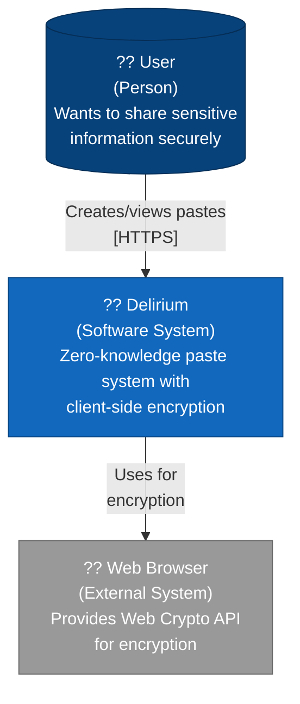
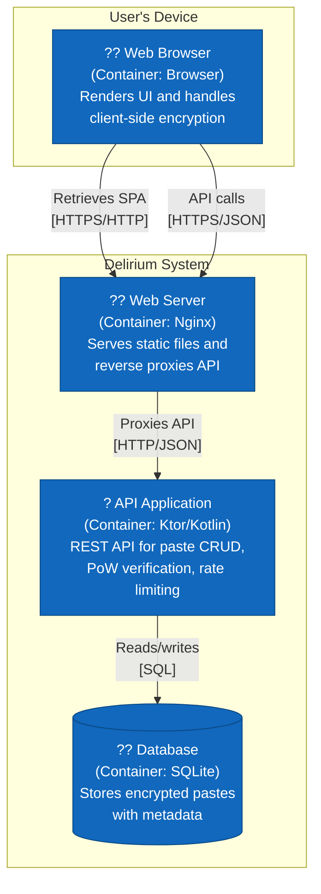
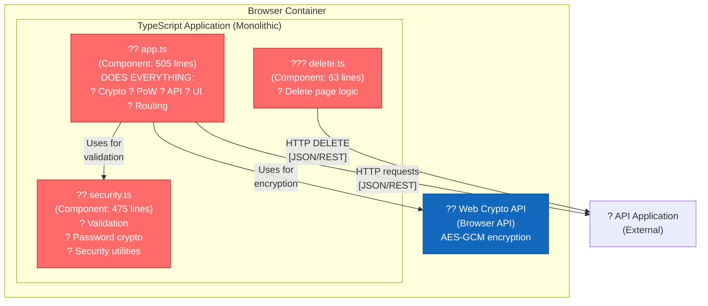
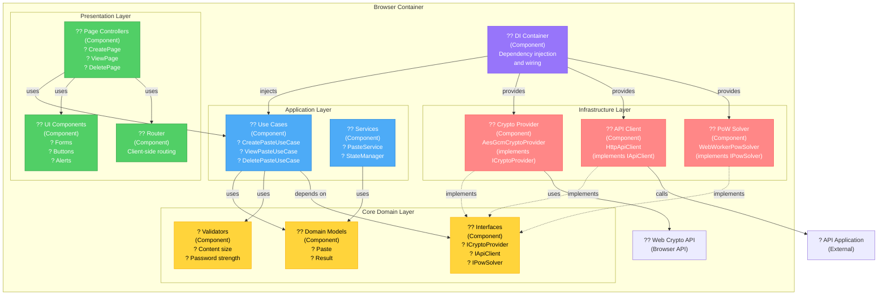
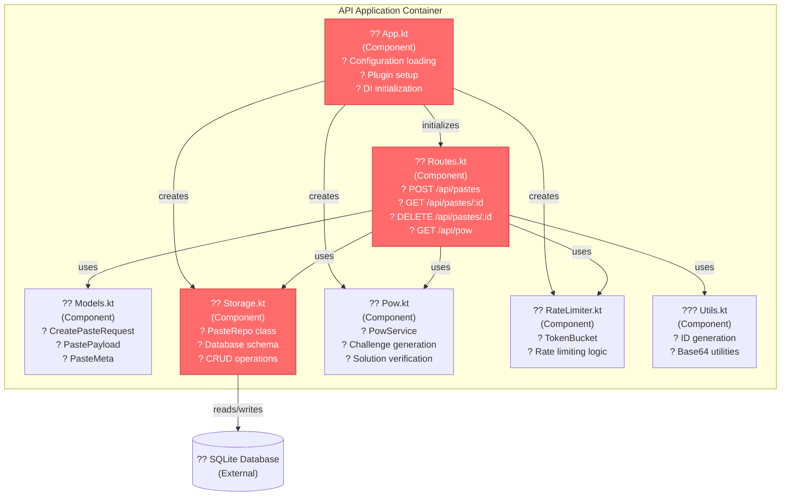
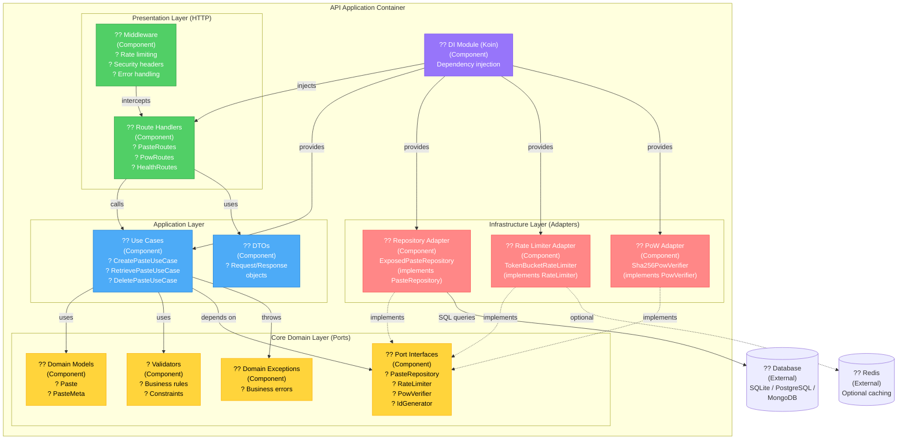
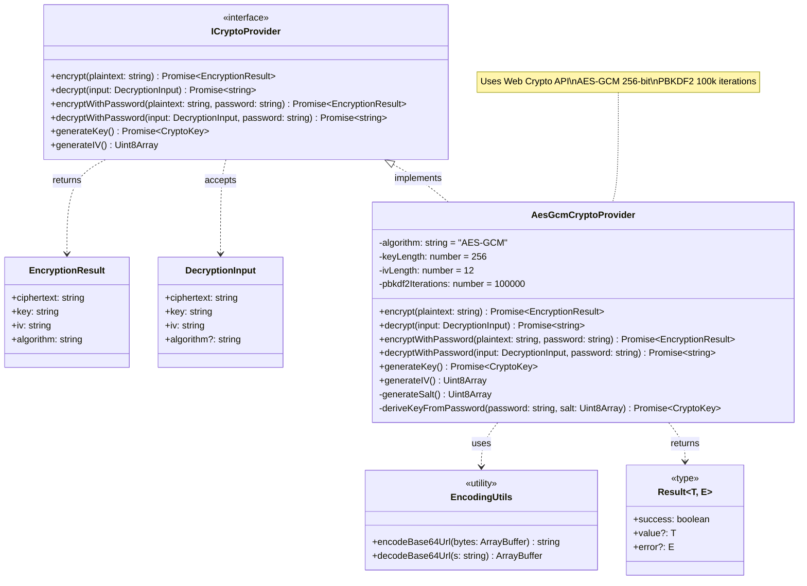
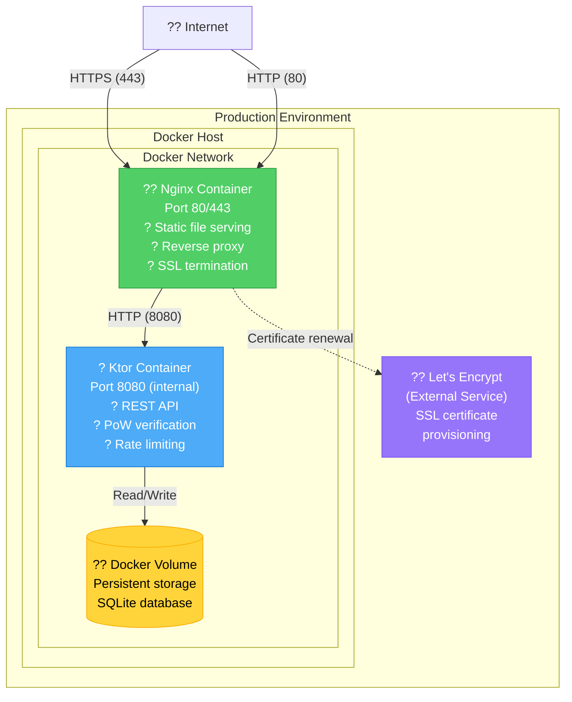
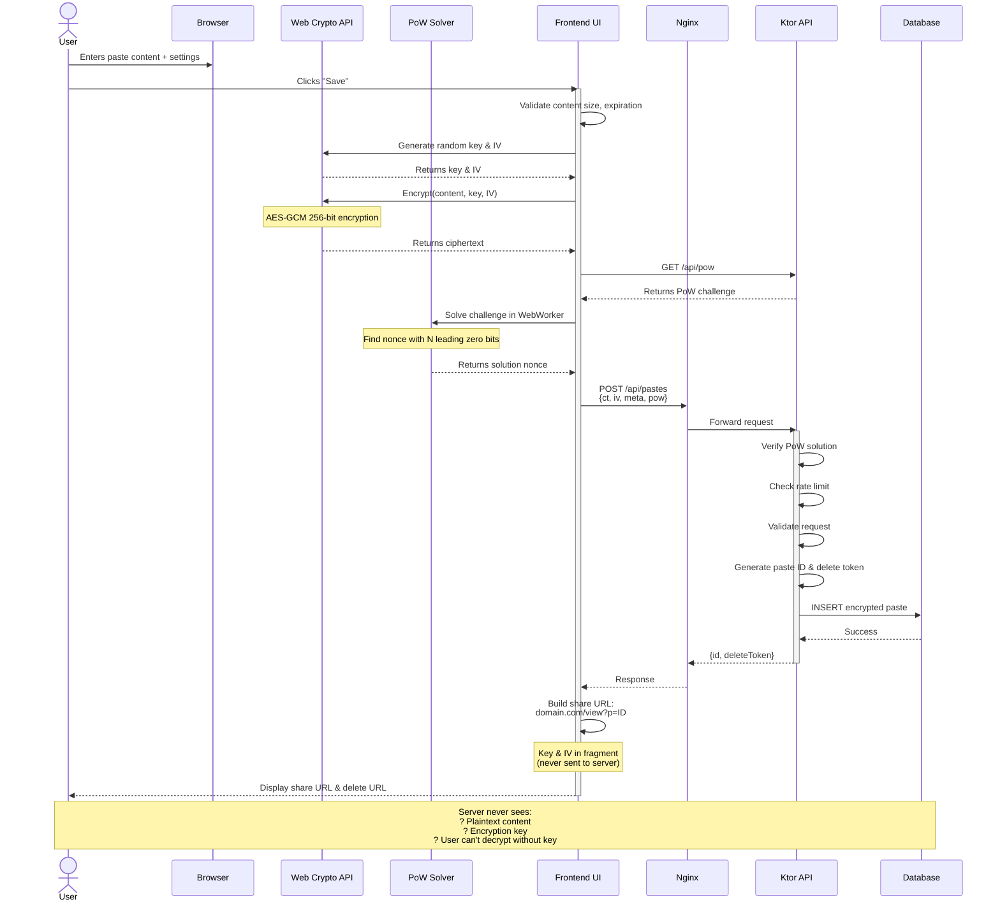

# C4 Architecture Model for Delirium

This document follows the [C4 model](https://c4model.com/) for visualizing software architecture at multiple levels of abstraction.

## Level 1: System Context Diagram

Shows Delirium in the context of users and external systems.



**Key Points:**

- **Zero-knowledge**: Server never sees unencrypted content
- **Client-side encryption**: All encryption happens in browser
- **Privacy-first**: No accounts, no tracking, no analytics

---

## Level 2: Container Diagram

Shows the high-level technology choices and how containers communicate.



**Technology Choices:**

- **Frontend**: TypeScript SPA with Web Crypto API
- **Reverse Proxy**: Nginx for static files and API routing
- **Backend**: Ktor (Kotlin) REST API on JVM
- **Database**: SQLite with Exposed SQL library
- **Deployment**: Docker Compose orchestration

---

## Level 3: Component Diagram - Frontend (Current State)

Shows the internal structure of the TypeScript client **before modularization**.



**Problems with Current State:**

- ? `app.ts` has too many responsibilities (SRP violation)
- ? Hard to test components in isolation
- ? Difficult to extend or customize
- ? Tight coupling between layers

---

## Level 3: Component Diagram - Frontend (Target Modular Architecture)

Shows the **target** modular architecture after refactoring (13 PRs).



**Benefits of Target Architecture:**

- ? Clear separation of concerns (Presentation, Application, Domain, Infrastructure)
- ? Dependency inversion (depend on interfaces, not implementations)
- ? Easy to test (mock interfaces in tests)
- ? Easy to extend (implement interfaces for custom behavior)
- ? Plugin architecture for customization

**Dependency Flow:**

```text
Presentation ? Application ? Core Domain ? Infrastructure
                              (no dependencies)    ?
                                              External Systems
```

**Extension Points:**

- Implement `ICryptoProvider` for custom encryption
- Implement `IApiClient` for custom API backends
- Implement `IPowSolver` for alternative PoW algorithms

---

## Level 3: Component Diagram - Backend (Current State)

Shows the internal structure of the Ktor backend **before modularization**.



**Problems with Current State:**

- ? No clear layering (domain vs infrastructure)
- ? Hard to swap implementations (e.g., MongoDB instead of SQLite)
- ? Routes contain business logic
- ? Tight coupling to Exposed SQL library

---

## Level 3: Component Diagram - Backend (Target Hexagonal Architecture)

Shows the **target** backend architecture using Hexagonal/Ports & Adapters pattern.



**Benefits of Target Architecture:**

- ? Hexagonal/Ports & Adapters architecture
- ? Easy to swap storage (implement `PasteRepository`)
- ? Easy to test (mock ports)
- ? Clean separation of concerns
- ? Business logic independent of framework

**Extension Points:**

- Implement `PasteRepository` for different databases (MongoDB, Redis, S3)
- Implement `RateLimiter` for distributed rate limiting
- Implement `PowVerifier` for alternative PoW algorithms

---

## Level 4: Code Diagram - Crypto Module (PR #1)

Shows the actual code-level structure of the crypto module.



**Design Patterns:**

- **Strategy Pattern**: `ICryptoProvider` allows swapping algorithms
- **Factory Pattern**: `createCryptoProvider()` creates instances
- **Result Type**: Type-safe error handling instead of exceptions

---

## Deployment Diagram

Shows how the system is deployed in production.



**Deployment Configuration:**

- **Development**: `docker-compose.yml` (port 8080, HTTP)
- **Production**: `docker-compose.prod.yml` (ports 80/443, HTTPS)
- **Secure**: `docker-compose.secure.yml` (HTTPS with Let's Encrypt)

---

## Data Flow Diagram - Creating a Paste

Shows the complete flow when a user creates a paste.



**Security Properties:**

1. **Zero-knowledge**: Server never sees plaintext
2. **Client-side encryption**: All crypto in browser
3. **Key in fragment**: Encryption key never sent to server
4. **PoW spam protection**: Prevents abuse
5. **Rate limiting**: Additional abuse protection

---

## C4 Model Summary

| Level | Name | Audience | Description |
|-------|------|----------|-------------|
| 1 | System Context | Everyone | Delirium in context of users and external systems |
| 2 | Container | Technical people | High-level tech choices (Nginx, Ktor, SQLite) |
| 3 | Component | Developers | Internal structure of containers |
| 4 | Code | Developers | Class-level design of specific modules |

**Additional Diagrams:**

- **Deployment**: How system is deployed (Docker)
- **Data Flow**: Sequence of operations for paste creation

---

## Legend

### C4 Model Colors

- ?? **Blue** (#1168bd): Software systems and containers
- ?? **Green** (#51cf66): Presentation layer components
- ?? **Light Blue** (#4dabf7): Application layer components
- ?? **Yellow** (#ffd43b): Domain/core components
- ?? **Red** (#ff8787): Infrastructure components
- ?? **Purple** (#9775fa): Cross-cutting concerns (DI, config)

### Diagram Types

- **Solid lines** (?): Direct dependencies
- **Dashed lines** (-.->): Implements interface
- **Boxes**: Components or containers
- **Cylinders**: Databases
- **People icons**: Actors/users

---

## Next Steps

After all 13 PRs are merged, the architecture will transform from the "Current State" monolithic design to the "Target Architecture" modular design.

**See**: `REFACTORING-PLAN.md` for the complete migration strategy.
