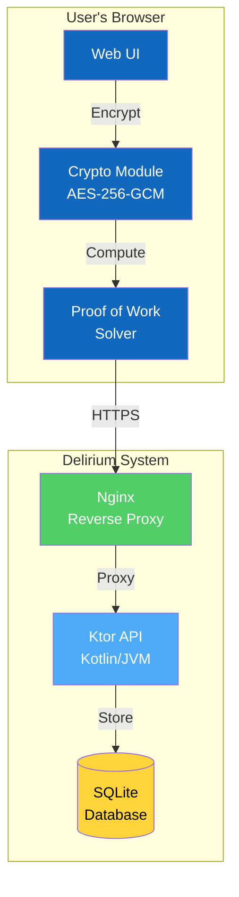

# Delirium - Zero-Knowledge Paste System

**Version:** 1.0.0  
**Architecture:** Multi-Repository  
**Status:** Production Ready

A secure, privacy-focused paste system that ensures complete client-side encryption before data ever leaves your browser. Built with TypeScript, Kotlin (Ktor), and a commitment to zero-knowledge architecture.

---

## 🌟 Overview

Delirium is a zero-knowledge encrypted paste service where the server never sees your unencrypted data. All encryption happens client-side using AES-256-GCM, ensuring true end-to-end privacy.

**Key Principle:** *If you have nothing to hide, why do you have a lock on your door?* 🔒

Inspired by PrivateBin and old-school pastebin culture, Delirium puts privacy and anonymity first.

---

## 🏗️ Architecture

Delirium uses a **multi-repository architecture** for better maintainability and independent release cycles:

### Core Repositories

#### 📱 [delerium-client](https://github.com/YOUR-USERNAME/delerium-client)
**Frontend TypeScript Application**

- Client-side encryption (AES-256-GCM)
- Web Crypto API integration
- Comprehensive test suite (Jest + Playwright)
- Type-safe TypeScript codebase

**Quick Start:**
```bash
git clone https://github.com/YOUR-USERNAME/delerium-client.git
cd delerium-client
npm install && npm run build
```

#### ⚡ [delerium-server](https://github.com/YOUR-USERNAME/delerium-server)
**Backend Kotlin/Ktor API**

- REST API for paste operations
- Proof-of-work spam protection
- SQLite database with Exposed
- OWASP dependency scanning

**Quick Start:**
```bash
git clone https://github.com/YOUR-USERNAME/delerium-server.git
cd delerium-server
./gradlew run
```

#### 🐳 [delerium-infrastructure](https://github.com/YOUR-USERNAME/delerium-infrastructure)
**Deployment & Orchestration**

- Docker Compose configurations
- Nginx reverse proxy
- Automated deployment scripts
- SSL/TLS setup tools

**Quick Start:**
```bash
git clone https://github.com/YOUR-USERNAME/delerium-infrastructure.git
cd delerium-infrastructure
./scripts/setup.sh
```

---

## 🚀 Getting Started

### Option 1: Quick Deploy (Recommended)

Deploy the entire stack in under 5 minutes:

```bash
# Clone infrastructure repository
git clone https://github.com/YOUR-USERNAME/delerium-infrastructure.git
cd delerium-infrastructure

# Run automated setup
./scripts/setup.sh

# Access at http://localhost:8080
```

The setup script will:
- ✅ Check prerequisites (Docker, Docker Compose)
- ✅ Generate secure secrets automatically
- ✅ Pull pre-built container images
- ✅ Start all services
- ✅ Verify health status

### Option 2: Local Development

For contributing or customizing:

```bash
# Create workspace
mkdir delerium-dev && cd delerium-dev

# Clone all repositories
git clone https://github.com/YOUR-USERNAME/delerium-client.git
git clone https://github.com/YOUR-USERNAME/delerium-server.git
git clone https://github.com/YOUR-USERNAME/delerium-infrastructure.git

# Start development environment
cd delerium-infrastructure
./scripts/setup.sh --dev
```

---

## ✨ Features

### 🔐 Security

- **Zero-Knowledge Architecture** - Server never sees unencrypted data
- **Client-Side Encryption** - AES-256-GCM encryption in browser
- **Perfect Forward Secrecy** - Unique keys per paste
- **Secure Deletion** - Cryptographic token-based deletion
- **Proof of Work** - Spam protection without accounts

### 🎯 Privacy

- **No Accounts Required** - Truly anonymous
- **No Tracking** - No analytics, no cookies
- **No Logging** - Minimal server logs
- **Self-Destructing Pastes** - Single-view option
- **Expiration Support** - Time-limited pastes

### 🛠️ Developer Experience

- **Type-Safe** - TypeScript + Kotlin for reliability
- **Comprehensive Tests** - Unit, integration, and E2E coverage
- **CI/CD Ready** - GitHub Actions pipelines
- **Docker Native** - Easy deployment anywhere
- **Well Documented** - Architecture diagrams + guides

---

## 📊 System Architecture



**Key Flow:**
1. User writes paste in browser
2. Client encrypts with AES-256-GCM
3. Client computes proof-of-work
4. Encrypted data sent to server
5. Server stores encrypted blob (never sees plaintext)
6. Client generates shareable link with decryption key in URL fragment

**Security Guarantee:** The server only stores encrypted ciphertext. The decryption key never leaves the client or reaches the server.

---

## 📚 Documentation

### Getting Started
- [Quick Start Guide](docs/getting-started/QUICK_START.md) - 5-minute setup
- [Development Guide](docs/getting-started/DEVELOPMENT.md) - Local development
- [Deployment Guide](docs/getting-started/DEPLOYMENT.md) - Production setup

### Architecture
- [C4 Architecture Diagrams](docs/architecture/C4-DIAGRAMS.md) - System design
- [Proof of Work](docs/architecture/PROOF_OF_WORK.md) - PoW implementation
- [Security Overview](docs/architecture/OVERVIEW.md) - Security model

### Contributing
- [Contributing Guide](docs/contributing/CONTRIBUTING.md) - How to contribute
- [Code Standards](docs/contributing/CODE_STANDARDS.md) - Style guide
- [PR Guidelines](docs/contributing/PR_GUIDELINES.md) - Pull request process

### Security
- [Security Policy](docs/security/SECURITY.md) - Security practices
- [Responsible Disclosure](docs/security/RESPONSIBLE_DISCLOSURE.md) - Report vulnerabilities

---

## 🤝 Contributing

We welcome contributions to all Delirium repositories!

### Quick Contribution Guide

1. **Choose a repository** based on what you want to work on:
   - Frontend/UI → `delerium-client`
   - Backend/API → `delerium-server`
   - Infrastructure → `delerium-infrastructure`
   - Documentation → `delerium`

2. **Fork and clone** the appropriate repository

3. **Create a feature branch**:
   ```bash
   git checkout -b feature/your-feature-name
   ```

4. **Make your changes** with tests

5. **Run quality checks**:
   ```bash
   # Client
   npm run lint && npm run test:all
   
   # Server
   ./gradlew test
   
   # Infrastructure
   docker compose config
   ```

6. **Submit a pull request** with clear description

### Contribution Standards

- ✅ **Write tests** for new features
- ✅ **Follow code style** (ESLint/Kotlin conventions)
- ✅ **Keep PRs focused** (100-300 lines ideal)
- ✅ **Update documentation** as needed
- ✅ **All CI checks must pass**

See detailed guidelines in [CONTRIBUTING.md](CONTRIBUTING.md).

---

## 📈 Project Stats

### Current Version: 1.0.0

- **Client:** v1.0.0 - TypeScript SPA with 22 source files, 21 test files
- **Server:** v1.0.0 - Kotlin/Ktor API with 18 source files
- **Infrastructure:** v1.0.0 - Docker Compose + deployment tools

### Test Coverage

- **Client Tests:** 60+ tests (unit + integration + E2E)
- **Server Tests:** Comprehensive Ktor test suite
- **Integration Tests:** Full-stack E2E scenarios

### CI/CD

- ✅ Automated testing on all PRs
- ✅ Docker image publishing to GHCR
- ✅ Security scanning (npm audit + OWASP)
- ✅ Daily integration test runs

---

## 🔒 Security

### Reporting Security Issues

**Do not open public GitHub issues for security vulnerabilities.**

Instead, please email: [Your security email]

Or use GitHub's private security advisories feature in the appropriate repository.

### Security Features

- 🔐 **AES-256-GCM** encryption
- 🔑 **Cryptographically secure** key generation
- 🛡️ **HTTPS/TLS** for all connections
- 🚫 **No plaintext storage** ever
- ⏱️ **Auto-expiration** of pastes
- 🔨 **Proof-of-work** spam protection

### Security Audits

Regular security practices:
- Automated dependency scanning
- OWASP dependency checks
- npm audit on every PR
- Manual security reviews

---

## 🗺️ Roadmap

### Version 1.1 (Q1 2026)
- [ ] Syntax highlighting for code pastes
- [ ] Dark mode theme
- [ ] API rate limiting improvements
- [ ] Mobile app (React Native)

### Version 1.2 (Q2 2026)
- [ ] File attachment support (encrypted)
- [ ] Markdown rendering
- [ ] Password-protected pastes
- [ ] Custom expiration times

### Version 2.0 (Q3 2026)
- [ ] End-to-end encrypted chat
- [ ] Peer-to-peer paste sharing
- [ ] WebRTC for real-time collaboration
- [ ] Decentralized storage options

See [ROADMAP.md](ROADMAP.md) for detailed planning.

---

## 📄 License

This project is licensed under the **MIT License** - see the [LICENSE](LICENSE) file for details.

### What this means:
- ✅ Commercial use allowed
- ✅ Modification allowed
- ✅ Distribution allowed
- ✅ Private use allowed
- ⚠️ No warranty provided
- ⚠️ License and copyright notice required

---

## 🙏 Acknowledgments

### Inspiration
- **PrivateBin** - For pioneering zero-knowledge paste services
- **Old-school pastebins** - For the original concept
- **Privacy advocates** - For fighting for digital rights

### Technology
- **Ktor** - Excellent Kotlin web framework
- **TypeScript** - Type-safe JavaScript development
- **Web Crypto API** - Browser-native encryption
- **Docker** - Simplified deployment
- **GitHub Actions** - CI/CD automation

### Community
- All contributors who have helped improve Delirium
- Security researchers who report vulnerabilities responsibly
- Users who trust us with their encrypted data

---

## 🔗 Links

- **Main Repository:** [github.com/YOUR-USERNAME/delerium](https://github.com/YOUR-USERNAME/delerium)
- **Client:** [github.com/YOUR-USERNAME/delerium-client](https://github.com/YOUR-USERNAME/delerium-client)
- **Server:** [github.com/YOUR-USERNAME/delerium-server](https://github.com/YOUR-USERNAME/delerium-server)
- **Infrastructure:** [github.com/YOUR-USERNAME/delerium-infrastructure](https://github.com/YOUR-USERNAME/delerium-infrastructure)
- **Documentation:** [github.com/YOUR-USERNAME/delerium/docs](https://github.com/YOUR-USERNAME/delerium/tree/main/docs)
- **Issues:** Report in the appropriate repository
- **Discussions:** [github.com/YOUR-USERNAME/delerium/discussions](https://github.com/YOUR-USERNAME/delerium/discussions)

---

## 💬 Community

Join the conversation:

- 💬 **GitHub Discussions** - Questions and ideas
- 🐛 **GitHub Issues** - Bug reports and feature requests
- 📧 **Email** - [Your email]
- 🐦 **Twitter** - [Your handle] (if applicable)

---

## 🎉 Get Started Now!

```bash
git clone https://github.com/YOUR-USERNAME/delerium-infrastructure.git
cd delerium-infrastructure
./scripts/setup.sh
```

**Access at http://localhost:8080 in under 5 minutes!**

---

**HACK THE PLANET! 🌍**

---

*Built with ❤️ by the Delirium community*  
*Last updated: 2025-11-16*
