# CI/CD Architecture (Consolidated)

**Last Updated**: November 23, 2025  
**Status**: ✅ Consolidated (7 workflows → 4 workflows)

## Overview

The Delerium CI/CD pipeline has been consolidated from **7 overlapping workflows** to **4 streamlined workflows** that provide comprehensive coverage while reducing complexity and runner minutes.

### Key Metrics

| Metric | Before | After | Improvement |
|--------|--------|-------|-------------|
| Active Workflows | 7 | 4 | -43% |
| PR Check Duration | ~8-10 min | ~5 min | -40% |
| Runner Minutes per PR | ~15 min | ~9 min | -40% |
| Maintenance Complexity | High | Low | Significant ✅ |

---

## Consolidated Workflow Architecture

### 1. **PR Quality Gates** (pr-checks.yml)

The master workflow that consolidates all PR-blocking checks.

**Replaces:**
- ~~client-ci.yml~~ (frontend checks)
- ~~server-ci.yml~~ (backend checks + docker tests)

**Triggers:**
```yaml
on:
  pull_request:
    branches: [main, '**']
  push:
    branches: [main, parity]
```

**Parallel Jobs:**

```mermaid
graph LR
    PR["📝 PR/Push Event"] --> Frontend["Frontend Checks"]
    PR --> Backend["Backend Checks"]
    PR --> Docker["Docker Checks"]
    Frontend --> Summary["Summary Report"]
    Backend --> Summary
    Docker --> Summary
    
    style Frontend fill:#4dabf7
    style Backend fill:#4dabf7
    style Docker fill:#4dabf7
    style Summary fill:#51cf66
```



**Frontend Checks Job**
- Runs on: `ubuntu-24.04`
- Steps:
  - ✅ Install dependencies (cached)
  - ✅ ESLint: Code style & quality
  - ✅ TypeScript: Type checking (`tsc --noEmit`)
  - ✅ Unit Tests: Jest suite
  - ✅ Coverage Report: 85% minimum threshold
  - ✅ Security Audit: npm vulnerabilities (moderate+)

**Backend Checks Job**
- Runs on: `ubuntu-24.04`
- Steps:
  - ✅ Set up JDK 21 (Temurin)
  - ✅ Gradle Build: Clean build & test
  - ✅ All unit tests pass
  - ⊘ OWASP Dependency Check (moved to security-scan.yml)

**Docker Checks Job**
- Runs on: `ubuntu-24.04`
- Steps:
  - ✅ Docker Compose config validation
  - ✅ Build all Docker images in parallel
  - ✅ Start services
  - ✅ Health check: Verify all containers running
  - ✅ HTTP check: Verify nginx responding

**Summary Job**
- Waits for all three jobs to complete
- Reports overall PR status
- Fails if any job failed

### 2. **Security Scan** (security-scan.yml)

Independent security scanning workflow that runs **separately from PRs**.

**Replaces:**
- Part of security-scan.yml (now excludes PRs)

**Triggers:**
```yaml
on:
  # Scheduled daily scan
  schedule:
    - cron: '0 2 * * *'  # 2 AM UTC every day
  
  # On release tags
  push:
    tags:
      - 'v*.*.*-alpha'
      - 'v*.*.*-beta'
      - 'v*.*.*'
  
  # Manual trigger
  workflow_dispatch:
```

**⚠️ NOT triggered by:** `pull_request` (all security checks are in pr-checks.yml)

**Jobs:**

| Job | Purpose | Tools |
|-----|---------|-------|
| **Frontend Security** | Npm vulnerability audit | npm audit (moderate+) |
| **Backend Security** | OWASP dependency check | Gradle dependencyCheckAnalyze |

**Reports:**
- Publishes detailed security report to GitHub Actions Summary
- Tracks vulnerabilities by severity (Critical, High, Moderate)
- Uploads artifacts for manual review

**When It Runs:**
- 🕐 Every day at 2 AM UTC (nightly scans)
- 🏷️ Automatically on version tags (before release)
- 🚀 Manually via "Run workflow" in GitHub UI

### 3. **Docker Publishing** (docker-publish.yml)

Multi-architecture Docker image builds and publishing.

**Replaces:**
- ~~docker-hub-server.yml~~ (manual publish workflow)

**Triggers:**

```yaml
on:
  # Manual dispatch (on-demand publishing)
  workflow_dispatch:
    inputs:
      tag:
        description: 'Optional custom tag (e.g., 1.0.0, latest)'
        default: ''

  # On main branch push
  push:
    branches: [ main ]
    paths: [ server/**, .github/workflows/docker-publish.yml ]
    tags: [ 'v*' ]

  # On version tags


  # On PR (build only, don't push)
  pull_request:
    paths: [ server/**, .github/workflows/docker-publish.yml ]
```

**Platforms:**
- `linux/amd64` - Traditional x86_64 servers
- `linux/arm64` - Apple Silicon (M1/M2/M3), AWS Graviton, Raspberry Pi 4+

**Registries:**
- 🐳 Docker Hub (if `DOCKERHUB_ENABLED` = true and credentials configured)
- 🟦 GitHub Container Registry (GHCR) - Always enabled

**Jobs:**

| Event | Action |
|-------|--------|
| PR | Build multi-arch images (don't push) |
| Push to main | Build & push with auto-generated tags |
| Push tag v1.0.0 | Build & push with semantic version tags |
| workflow_dispatch | Build & push with custom tag (optional) |

**Tags Generated:**
- Branch: `main` → `latest`, `main`
- Semantic: `v1.2.3` → `1.2.3`, `1.2`, `1`, `latest`
- Custom: Workflow dispatch input (optional)

### 4. **Auto Release** (auto-release.yml)

Automatically creates Git tags from package.json version.

**Triggers:**
```yaml
on:
  push:
    branches: [main]
```

**Process:**
1. Extract version from `client/package.json`
2. Check if Git tag exists
3. If not, create new Git tag: `v{version}`
4. Triggers `docker-publish.yml` workflow

**Orthogonal:** Works independently of other workflows.

---

## Workflow Consolidation Details

### Frontend Consolidation (client-ci.yml → pr-checks.yml)

**What Was Duplicated:**
```
client-ci.yml (separate workflow):
├── lint job (ESLint)
├── typecheck job (TypeScript)
├── test job (Jest)
└── coverage job

pr-checks.yml:
└── frontend-checks (all combined)
```

**Why Combined:**
- ✅ Same dependencies (Node.js 20, same package.json)
- ✅ Parallel execution eliminates sequential job overhead
- ✅ Single node-modules cache instead of multiple cache keys
- ✅ Shared setup (checkout, Node setup)

**Result:** ~40% faster PR feedback by avoiding 4 separate job startups

### Backend Consolidation (server-ci.yml → pr-checks.yml)

**What Was Duplicated:**
```
server-ci.yml (separate workflow):
├── build-test job (Gradle build + tests)
├── security-scan job (OWASP - moved to security-scan.yml)
└── docker-test job (Docker container validation)

pr-checks.yml:
└── backend-checks (build + tests)
└── docker-checks (validation)
```

**Key Change:** OWASP dependency check moved to `security-scan.yml` (scheduled-only)
- ❌ Removed from PR flow (was slow, not blocking)
- ✅ Still runs daily in security-scan.yml
- ✅ Still runs on release tags

**Result:** Faster PR feedback + maintain security scanning

### Docker Consolidation (docker-hub-server.yml → docker-publish.yml)

**What Was Duplicated:**
```
docker-hub-server.yml:
├── Manual workflow_dispatch trigger
└── Docker Hub multi-arch build

docker-publish.yml:
├── Automatic push (main + tags)
└── Multi-registry (Docker Hub + GHCR)
```

**Consolidated To:**
```
docker-publish.yml:
├── Manual workflow_dispatch (with custom tag input)
├── Automatic push (main + tags)
└── Multi-registry (Docker Hub + GHCR)
```

**Result:** Single source of truth for Docker builds

---

## Local CI Scripts

### Purpose

These scripts are **local development tools** that mirror GitHub Actions workflows. They let you catch issues **before** pushing to GitHub.

### Scripts

| Script | Purpose | Duration | Use Case |
|--------|---------|----------|----------|
| `ci-verify-all.sh` | Full validation | ~5-8 min | Before pushing (comprehensive) |
| `ci-verify-quick.sh` | Fast validation | ~2 min | Before committing (iteration) |
| `ci-verify-frontend.sh` | Frontend only | ~3-5 min | Frontend development |
| `ci-verify-backend.sh` | Backend only | ~3-5 min | Backend development |

### What Each Script Does

**ci-verify-all.sh:**
```bash
Frontend checks:
  - ESLint
  - TypeScript (tsc --noEmit)
  - Unit tests (Jest)
  - E2E tests (Playwright)
  - Coverage report (85% threshold)
  - Security audit (npm)

Backend checks:
  - Gradle build
  - Unit tests
  - Dependency check (optional)

Docker validation:
  - docker-compose config
  - Build images
  - Start services
  - Health checks
```

**ci-verify-quick.sh:**
```bash
Frontend (fast):
  - ESLint
  - TypeScript
  - Unit tests only

Backend (fast):
  - Gradle build
  - Unit tests

Skipped:
  ⊘ E2E tests
  ⊘ Coverage
  ⊘ Security audit
  ⊘ Docker
```

### Usage

```bash
# Before committing (fast feedback)
./scripts/ci-verify-quick.sh

# Before pushing to GitHub (full validation)
./scripts/ci-verify-all.sh

# During frontend development
./scripts/ci-verify-frontend.sh

# During backend development
./scripts/ci-verify-backend.sh
```

### Why Local Scripts Exist

1. **No GitHub Actions wait time** - Instant feedback during development
2. **Save runner minutes** - Run locally, catch issues, then push
3. **Offline development** - No dependency on GitHub network
4. **Identical to CI** - Same commands as GitHub Actions
5. **Quick iteration** - Use `ci-verify-quick.sh` for rapid changes

### Important: GitHub Actions is Authoritative

Local scripts are **mirrors only**. GitHub Actions (pr-checks.yml) is the **source of truth**:
- Always passes locally? Great! But GitHub Actions still runs the authoritative checks.
- GitHub Actions fails? That's what matters. Local scripts may differ slightly (runners, timing, environment).
- When in doubt, trust GitHub Actions results.

---

## PR Workflow & Quality Gates

### Typical Developer Workflow

```mermaid
graph LR
    A["👨‍💻 Make Changes"] --> B["▶️ ./scripts/ci-verify-quick.sh"]
    B --> C{Pass?}
    C -->|Yes| D["🚀 git push"]
    C -->|No| A
    
    D --> E["🔍 pr-checks.yml runs"]
    E --> F{All checks pass?}
    F -->|Yes| G["✅ Ready to merge"]
    F -->|No| H["❌ Fix issues"]
    H --> A
    
    G --> I["🏷️ Merged to main"]
    I --> J["🐳 docker-publish.yml"]
    J --> K["🌍 Images published"]
    
    style A fill:#e7f5ff
    style B fill:#e7f5ff
    style D fill:#d3f9d8
    style E fill:#fff3bf
    style G fill:#d3f9d8
    style H fill:#ffe0e0
    style K fill:#d3f9d8
```



### Quality Gate Requirements

**All PR checks must pass:**
- ✅ Frontend ESLint + TypeScript + tests
- ✅ Backend Gradle build + tests
- ✅ Docker Compose validation + health checks
- ✅ Code coverage ≥85%
- ✅ No Critical/High security vulnerabilities

**Security scans run independently:**
- ✅ Scheduled daily at 2 AM UTC
- ✅ Manual trigger available
- ✅ Run on release tags
- ❌ Do NOT block PRs

---

## Performance Improvements

### Before Consolidation (7 Workflows)

- **PR Check Duration**: 8-10 minutes
  - client-ci.yml: ~3 min
  - server-ci.yml: ~4 min
  - pr-checks.yml: ~5 min (partial overlaps)
  - Sequential job startup overhead: ~2 min
  
- **Runner Minutes per PR**: ~15 min
  - Multiple workflow starts: 5 × ~1 min = 5 min overhead
  - Duplicate installations: ~3 min
  - Sequential execution: ~7 min

### After Consolidation (4 Workflows)

- **PR Check Duration**: ~5 minutes
  - Parallel execution (frontend + backend + docker): ~3 min
  - Single job startup: ~1 min
  - Caching efficiency: ~1 min
  
- **Runner Minutes per PR**: ~9 min
  - Single workflow start: ~1 min
  - Shared caches: ~0 min overhead
  - Parallel jobs: ~8 min total

### Savings

- **40% faster PR feedback** (8 min → 5 min)
- **40% fewer runner minutes** (15 min → 9 min)
- **Easier maintenance** (7 workflows → 4 workflows)

---

## Troubleshooting

### PR Check Failing

**Steps:**
1. Check GitHub Actions logs: Click the ❌ next to your PR commit
2. Identify which job failed (frontend-checks, backend-checks, docker-checks)
3. Click on the job to see detailed output
4. Run the corresponding local script to reproduce:
   ```bash
   ./scripts/ci-verify-frontend.sh    # Frontend failed
   ./scripts/ci-verify-backend.sh     # Backend failed
   ./scripts/ci-verify-all.sh         # Docker failed
   ```
5. Fix locally and re-test
6. Push again

### Security Scan Not Running

**Check:**
1. Is it scheduled? Should run daily at 2 AM UTC (check GitHub Actions)
2. Manual trigger: Go to Actions → security-scan.yml → "Run workflow"
3. Check logs for errors in the scan itself

### Docker Image Not Publishing

**Check:**
1. Did you push to main branch or create a tag?
2. Check docker-publish.yml workflow logs
3. Verify DOCKERHUB credentials are configured in GitHub Secrets
4. Manual trigger: Go to Actions → docker-publish.yml → "Run workflow" → enter optional tag

### Coverage Below 85%

**In pr-checks.yml frontend job:**
1. Coverage threshold: 85% minimum
2. Run locally: `./scripts/ci-verify-frontend.sh`
3. Check coverage report: `client/coverage/lcov-report/index.html`
4. Add tests for uncovered code
5. Re-run locally until ≥85%

---

## Configuration

### Environment Variables

**pr-checks.yml:**
- No special env vars required
- Runs in standard GitHub Actions environment

**security-scan.yml:**
- No special env vars required

**docker-publish.yml:**
- `vars.DOCKERHUB_ENABLED` - Set to 'true' to publish to Docker Hub
- `secrets.DOCKERHUB_USERNAME` - Docker Hub username
- `secrets.DOCKERHUB_TOKEN` - Docker Hub token

**auto-release.yml:**
- No special env vars required

### GitHub Secrets Required

To enable full functionality, configure these in GitHub Settings → Secrets:

| Secret | Purpose | Required |
|--------|---------|----------|
| `DOCKERHUB_USERNAME` | Docker Hub push | Optional (set vars.DOCKERHUB_ENABLED = false to skip) |
| `DOCKERHUB_TOKEN` | Docker Hub authentication | Optional |
| `GITHUB_TOKEN` | GHCR push (auto-provided) | ✅ Yes (built-in) |

---

## Migration from Old Workflows

### If You're Migrating from Before Consolidation

**Old Workflows (Deprecated):**
- `client-ci.yml` → ⚠️ Still exists but NOT triggered
- `server-ci.yml` → ⚠️ Still exists but NOT triggered
- `docker-hub-server.yml` → ⚠️ Still exists but NOT triggered

**New Workflows (Active):**
- `pr-checks.yml` → ✅ Handles all PR checks
- `security-scan.yml` → ✅ Runs independently (scheduled + manual)
- `docker-publish.yml` → ✅ Handles all Docker builds
- `auto-release.yml` → ✅ Auto-tagging

### What Changed for Me?

1. **PR checks are now in one workflow** (pr-checks.yml)
   - No more waiting for separate frontend/backend/server workflows
   - Faster feedback: ~5 min instead of ~8-10 min

2. **Local scripts still work**
   - `./scripts/ci-verify-all.sh` still runs all checks locally
   - Same commands, same results

3. **Security scans are independent**
   - Don't block PRs anymore
   - Still run daily (2 AM UTC) + on tags + manual

4. **Docker publishing is simplified**
   - One workflow (docker-publish.yml) handles everything
   - Manual override available via workflow_dispatch

---

## References

- **Local CI Scripts**: `./scripts/ci-verify-{all,quick,frontend,backend}.sh`
- **Workflow Files**: `.github/workflows/pr-checks.yml`, `.github/workflows/security-scan.yml`, `.github/workflows/docker-publish.yml`, `.github/workflows/auto-release.yml`
- **PR Guidelines**: `AGENTS.md` (CI/CD section)
- **Consolidation Plan**: `docs/deployment/CI_CD_CONSOLIDATION.md`
- **Test Guide**: `docs/development/TESTING.md`
- **Deployment Guide**: `docs/deployment/DEPLOYMENT.md`

---

**Status:** ✅ Complete - All workflows consolidated and tested  
**Last Updated:** November 23, 2025
